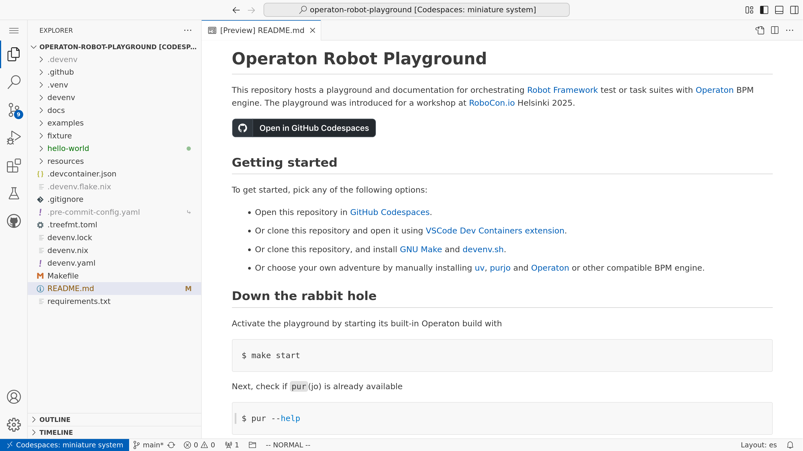

<!-- Syntax: https://myst-parser.readthedocs.io/ -->

# Operaton Robot Playground

Welcome to this opinionated documentation for documentation for orchestrating [Robot Framework](https://robotframework.org/) test or task suites with [Operaton](https://operaton.org/) BPM engine. The documentation was introduced for a workshop at [RoboCon.io](https://robocon.io/) Helsinki 2025.

This documentation accompanies a playground, which you can open in [GitHub Codespaces](https://codespaces.new/datakurre/operaton-robot-playground).

[](https://codespaces.new/datakurre/operaton-robot-playground)




## RoboCon.io Workshop 12th of Feb 2025

9.00 Welcome

* BPMN basics by examples

Break

* BPMN Modeling exercises

12.00--13.00 Lunch

* Introduction to the playground
  * Operaton
  * Pur(jo)
* Service tasks for Robot Framework
* Service tasks in action
* Service task exercises

Break

* Advanced topics
  * DMN & FEEL
  * More gateways (inclusive, event-based)
  * Compensation

16.00 Discussion

* How to adapt the tools for your own use cases

17.00 Workshop ends

## Preparations

The workshop playground has been tested with GitHub Codespaces, but with some effort, you can also run it locally. Check [Getting Started](https://github.com/datakurre/operaton-robot-playground#getting-started) at [the playground repository](https://github.com/datakurre/operation-robot-playground) for instructions on how to get the playground environment up and running.

<!--
## Table of Contents

TOC is published once sections are ready.

```{toctree}
:maxdepth: 1

```

bpmn/index.md
advanced/index.md
-->

