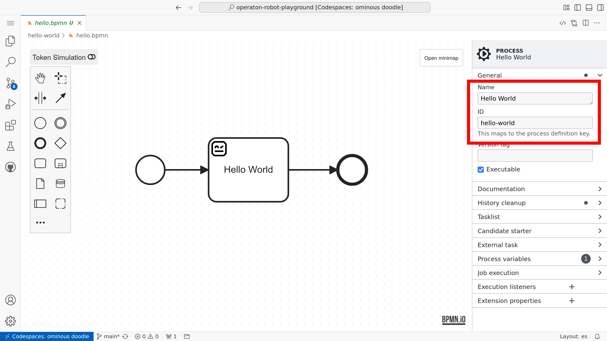

# Modeling for execution

BPMN 2.0 does not end with visual modeling, but may also contain execution instructions.

This is the use case for the technical sidebar of the modeler:


```{tip}
At the playground, you can create a new BPMN file with the `pur bpm create hello-world.bpmn` command in the terminal and then open the created BPMN file in the editor.
```

## Process name and Id

Every BPMN model (process definition) for executable processes should have a descriptive display **Name** and a unique definition **ID** set, with the Executable option checked. These settings are available on the properties panel when no element is selected.



## Service tasks

## External task pattern

In the Operaton engine, the external task pattern allows you to delegate work to external workers. This pattern is useful for tasks that need to be performed outside the BPMN engine, such as calling external services or performing long-running operations.

To configure an external task in your BPMN model:

1. **Add a Service Task**: Drag and drop a Service Task element onto your process diagram.

2. **Set Implementation**: In the properties panel, set the implementation type to `External`.

3. **Specify Topic**: Define a topic name that external workers will subscribe to. This topic acts as a queue for tasks that workers will fetch and complete.


External workers will then poll the Operaton engine for tasks with the specified topic, execute the required work, and report the completion status back to the engine.

```{tip}
Ensure that your external workers are robust and handle retries gracefully, as network issues or other transient errors can occur.
```

## Inputs and outputs

## Gateway paths

